# 基于实例分割与像素回归的温室生菜鲜重无损估算

## 从 YOLO26 分割到像素面积驱动的鲜重拟合


---
layout: two-cols
layoutClass: gap-x-8
---

## 北京菜篮子工程与研究关联


### 政策背景


- 北京市重要民生工程,保障首都蔬菜供应安全
- 推动设施农业与温室蔬菜规模化生产
- 需要精准化、智能化农业管理手段

::right::

### 技术切入点

- **精准表型监测需求**:温室规模化生产需要实时监控作物生长状态
- **传统方法痛点**:人工采收称重具有破坏性、低频、劳动成本高

<div class="grid grid-cols-2 gap-1">
  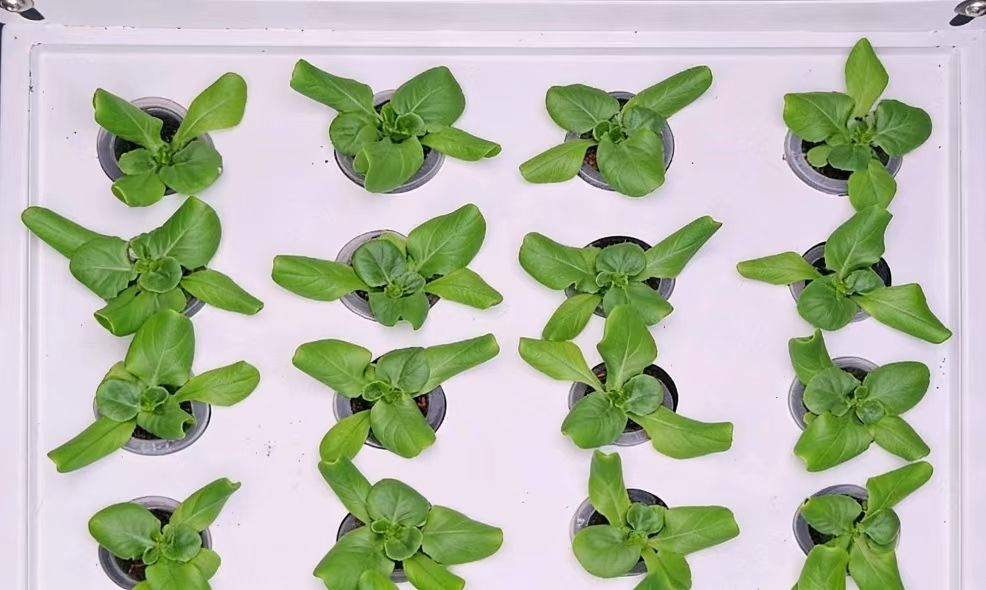
  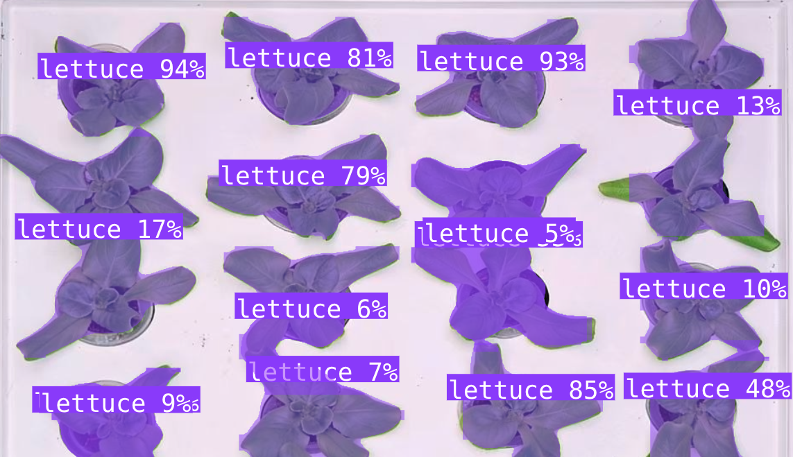
</div>

为此,本研究聚焦于利用计算机视觉与机器学习技术,实现基于顶视 RGB 图像的生菜鲜重无损估算,为北京菜篮子工程提供智能化表型监测解决方案。

---
layout: section
---

# 实验介绍

---

# 实验总体设计

<ExperimentFlow />


---
layout: two-cols
layoutClass: gap-x-8
---
# 数据集介绍

## 数据采集
<div class="grid grid-cols-3 gap-3 mt-4 *:w-30 mb-4">
  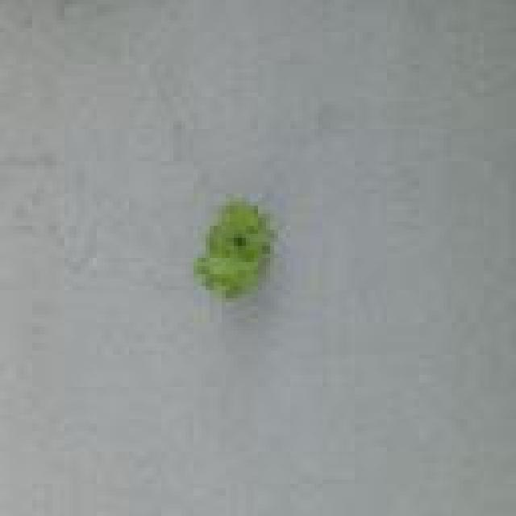
  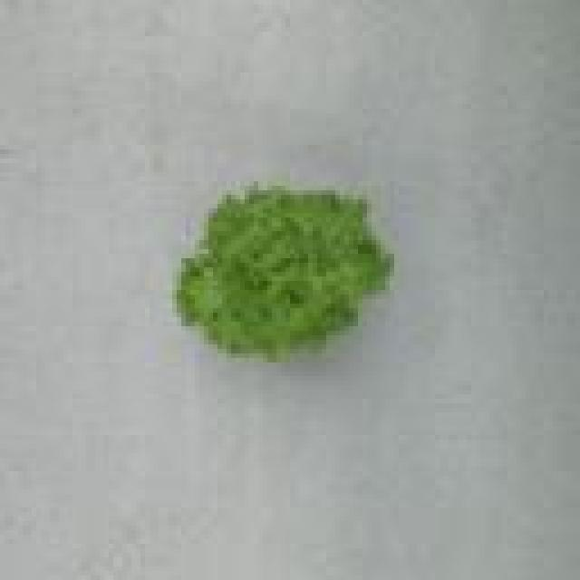
  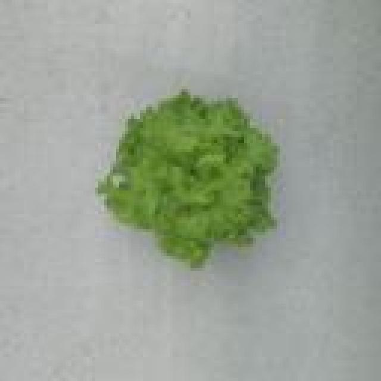
  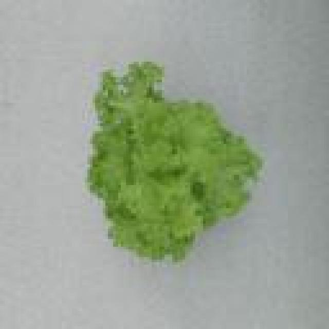
  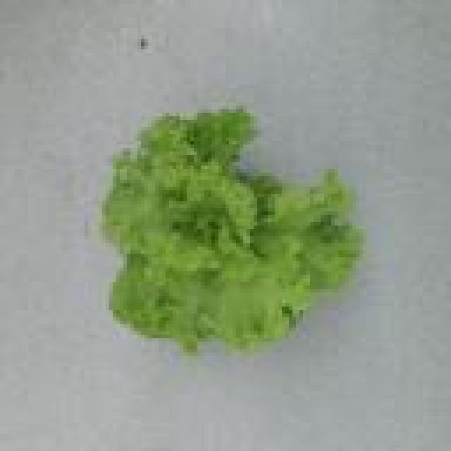
  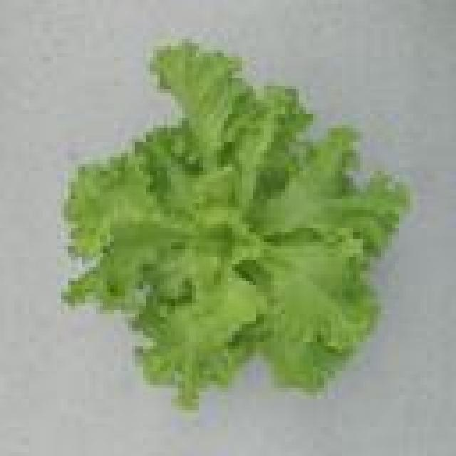
</div>

> 在温室环境下,通过固定高度与俯视角度拍摄生菜顶视图像,在不同生长阶段采集了 100 张图像样本,每张图像对应一个生菜样本的鲜重测量值。

::right::
## 数据标注
在`roboflow`平台上进行单类别实例分割标注,每个生菜样本的目标区域被精确分割成掩码
<div class="grid grid-cols-3 gap-4 mb-4">
  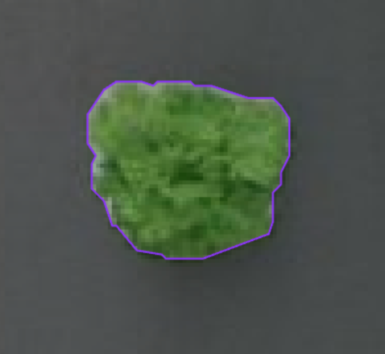
  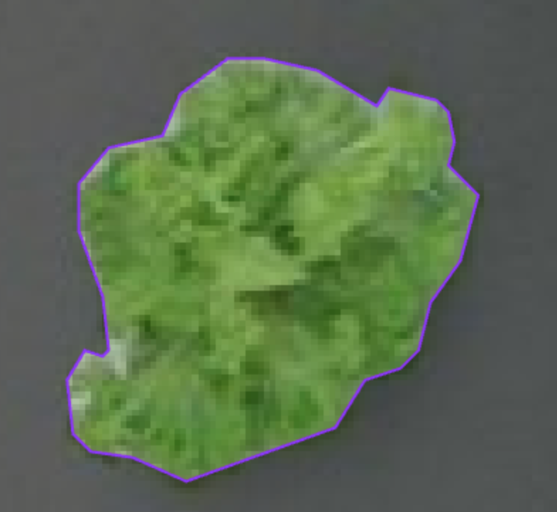
  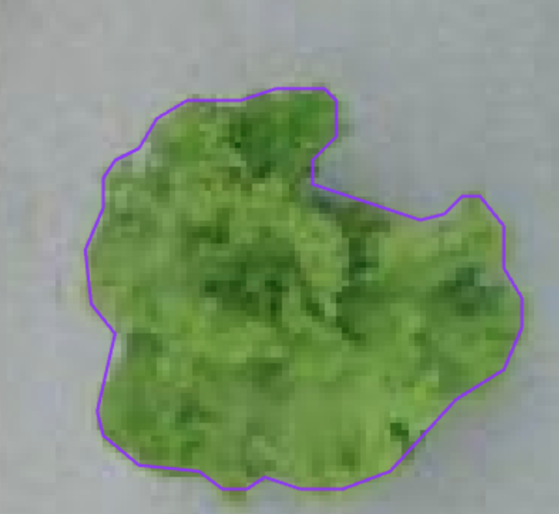
  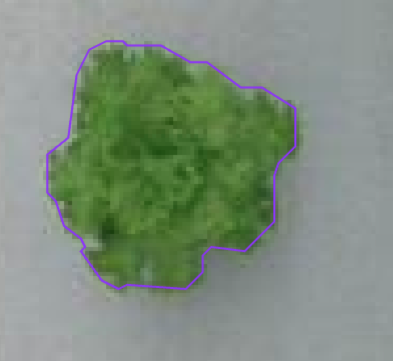
  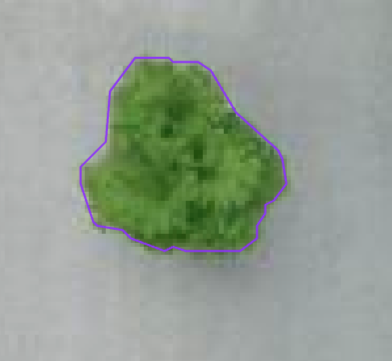
</div>

> 每个图像样本的生菜区域被精确分割成掩码,以供计算出每株生菜的像素面积特征,并与对应的鲜重测量值进行回归建模


---

# 研究假设与方法框架

## 核心假设

在拍摄高度、视角与分辨率保持一致时,生菜鲜重 $y$ 与分割掩码像素面积 $x$ 满足:

$$
y = f(x) + \epsilon
$$

其中:

- $x$ 为实例分割掩码合并后的前景像素总数
- $f(\cdot)$ 为待学习的质量映射函数
- $\epsilon$ 为测量误差、遮挡误差与模型误差

## 技术路线

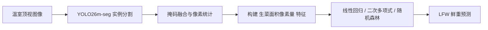
```mermaid
flowchart LR
  A[温室顶视图像] --> B[YOLO26m-seg 实例分割]
  B --> C[掩码融合与像素统计]
  C --> D[构建 生菜面积像素量 特征]
  D --> E[线性回归 / 二次多项式 / 随机森林]
  E --> F[LFW 鲜重预测]
```

---
layout: section
---

# 数据与分割实验

---

# 数据采集与样本构成

## 成像条件

- 拍摄方式:固定高度、正上方俯视
- 图像输入尺寸:统一为 `640 × 640`
- 标注任务:单类别实例分割,仅分割生菜目标区域


<div class="grid grid-cols-3 gap-3 mt-4 *:w-30">
  
  
  
  
  
  
</div>

---

# 分割模型与训练设置

## 模型选型

本研究采用 `YOLO26m-seg` 作为实例分割主干网络

## 训练代码片段

```python
from ultralytics import YOLO

model = YOLO('yolo26m-seg.pt')

results = model.train(
    data='/kaggle/working/lettuce_model/data.yaml',
    epochs=20,
    imgsz=640,
    batch=16,
    workers=4,
    device='0',
    exist_ok=True
)
```

---

# 生菜分割结果与评估


```python
metrics = model.val()
print(f"验证集分割 mAP50: {metrics.seg.map50:.4f}")
print(f"验证集分割 mAP50-95: {metrics.seg.map:.4f}")
```

| 指标 | 数值 |
|---|---:|
| mAP@50 | 0.9950 |
| mAP@50:95 | 0.9297 |
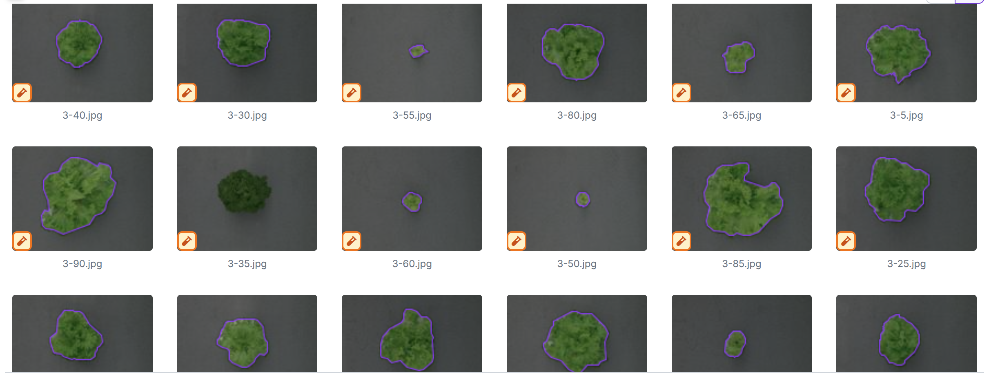
---
layout: section
---

# 像素特征构建

---
layout: two-cols
layoutClass: gap-x-4
---

# 掩码提取像素面积特征

**核心思路**:

分割模型输出的实例掩码,最终需转化为**单值像素面积特征**输入回归器:

$$
\text{lettuce\_pixels} = \sum_{u,v}\mathbf{1}(M(u,v)=1)
$$

- $M(u,v)$:融合后掩码在像素$(u,v)$处的取值(1=生菜区域,0=背景)
- $\sum$:统计所有生菜区域的像素总数

**核心实现细节**:
- `retina_masks=True`:生成更精细的高分辨率掩码
  
::right::
- `max(dim=0)`:对多个实例掩码逐像素取并集
- `bool().sum()`:统计前景像素总数,得到面积特征

**核心实现代码**

```python
# 步骤1:提取YOLO预测结果的首个输出
first_result = results[0]
# 步骤2:获取实例掩码对象(无掩码时为None)
masks = first_result.masks

# 步骤3:初始化像素总数(兜底无掩码场景)
total_pixels = 0

# 步骤4:掩码存在时计算总像素数
if masks is not None:
    # 多实例掩码融合(逐像素取最大值)
    combined_mask = masks.data.max(dim=0)[0]
    # 统计掩码中生菜区域的像素总数
    total_pixels = combined_mask.bool().sum().item()
```
---
layout: two-cols
layoutClass: gap-x-4
---

# 像素提取结果展示

<div class="w-full h-full flex flex-col items-center justify-center gap-4 mt-[-40px] ml-[-40px]">
  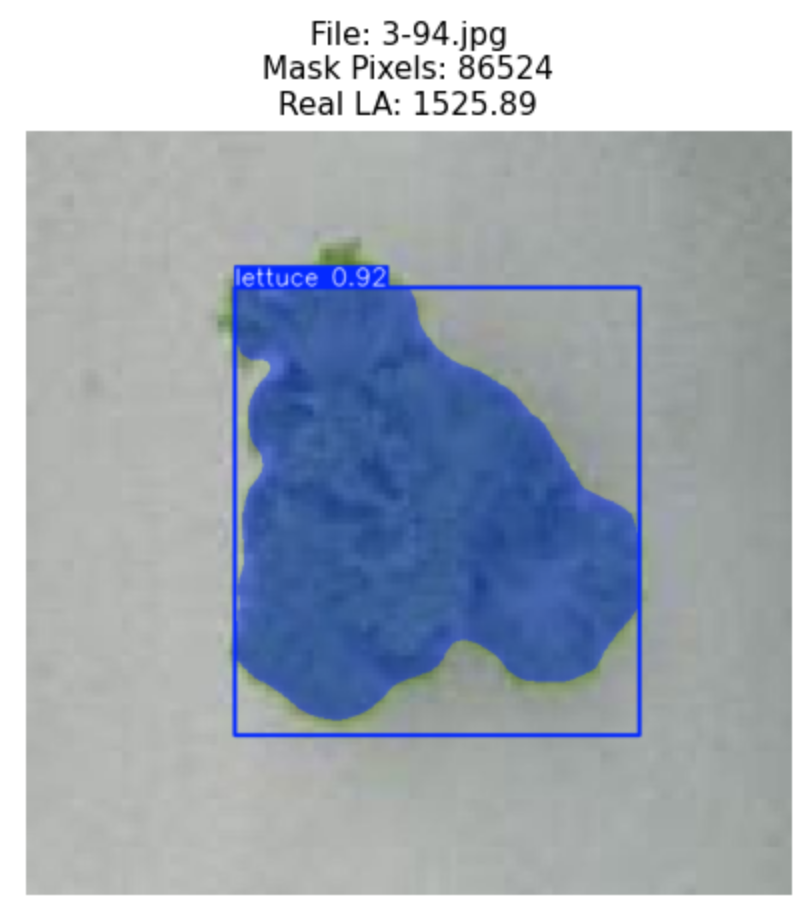
  <div class="w-full flex items-start justify-center gap-4">
    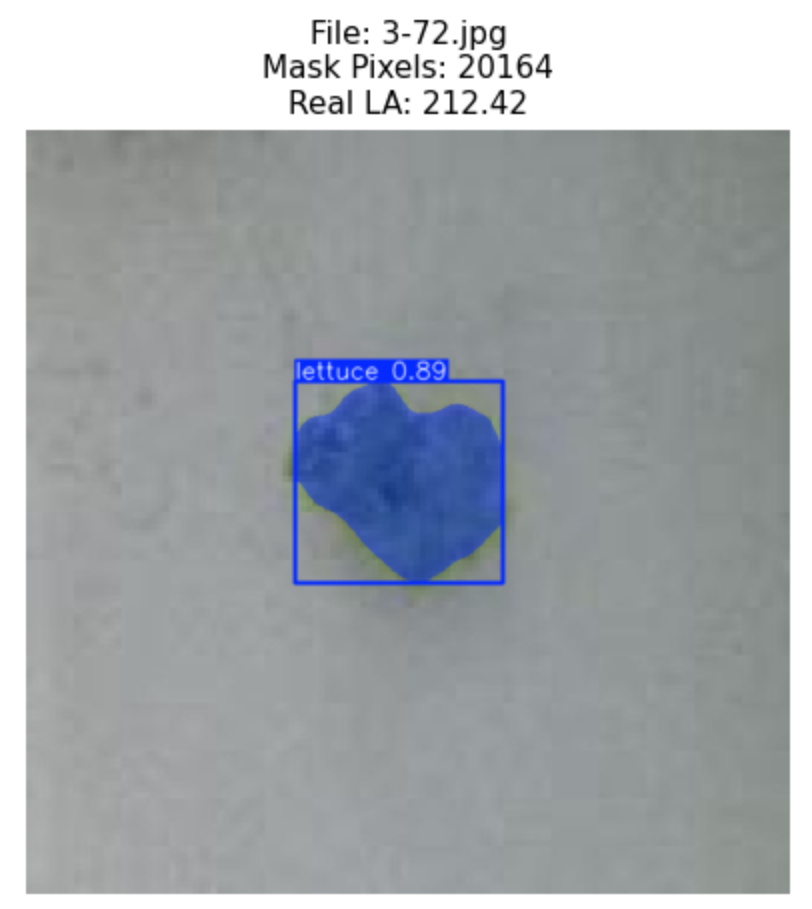
    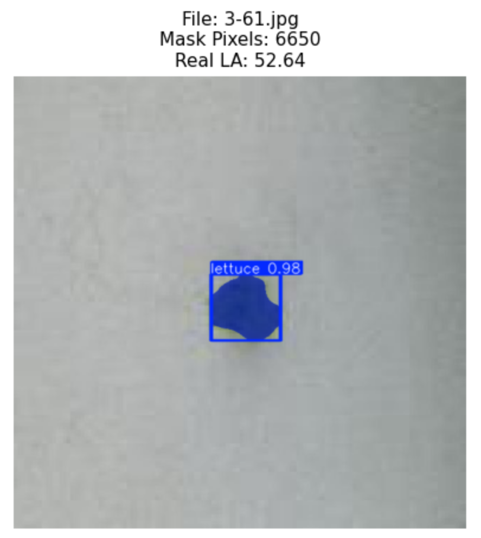
  </div>
</div>

::right::

**上图展示了三个样本的原始图像与对应的掩码提取及像素计算量结果**

由图可以看出,生菜的像素总数和它的重量之间存在明显的正相关关系,这为后续的回归建模提供了基础。

像素量 `->` 叶面积 `->` 生菜长势 `->` 鲜重

<Arrow x1="700" y1="250" x2="700" y2="320" />

<br />
<br />
<br />
<br />

生菜区域的像素总数(`lettuce_pixels`)作为变量特征,将被输入到后续的回归模型中,用于预测生菜鲜重(`LFW`)


---
layout: section
---

# 鲜重回归建模

---

## 线性回归

```python
model = LinearRegression()
model.fit(X_train, y_train)
print(f"R²: {model.score(X_test, y_test):.4f}")
print(f"公式: LFW = {model.coef_[0]:.6f} * pixels + {model.intercept_:.4f}")
```

## 二次多项式回归

```python
degree = 2
model = make_pipeline(PolynomialFeatures(degree), LinearRegression())
model.fit(X_train, y_train)
print(f"R² (多项式 degree={degree}): {model.score(X_test, y_test):.4f}")
```

## 随机森林回归

```python
model = RandomForestRegressor(n_estimators=100, random_state=42)
model.fit(X_train, y_train)
print(f"R² (随机森林): {model.score(X_test, y_test):.4f}")
```

---

<div class="w-full h-full grid grid-cols-2 grid-rows-2 gap-4 items-center justify-items-center p-4">
  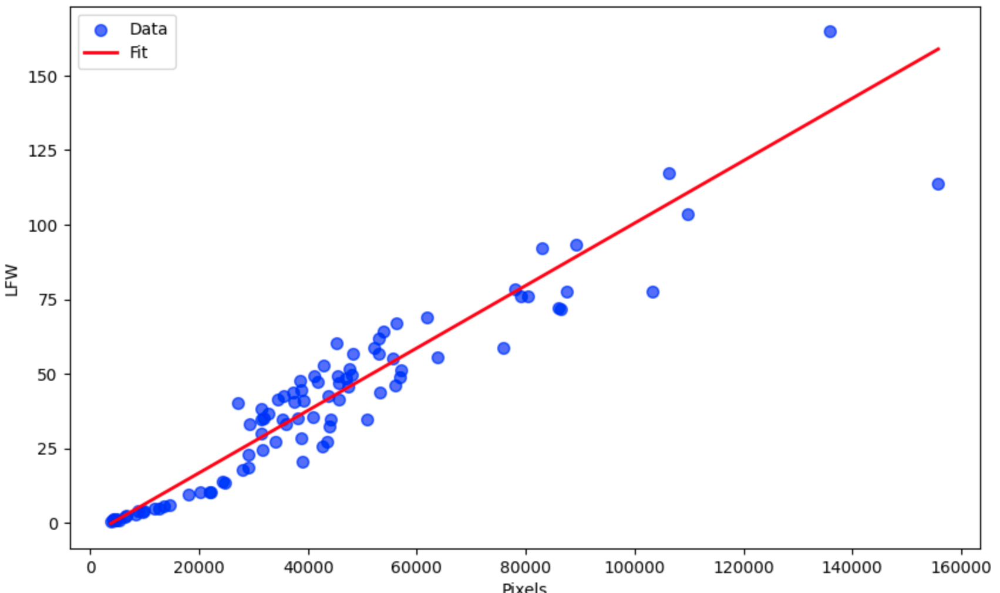
  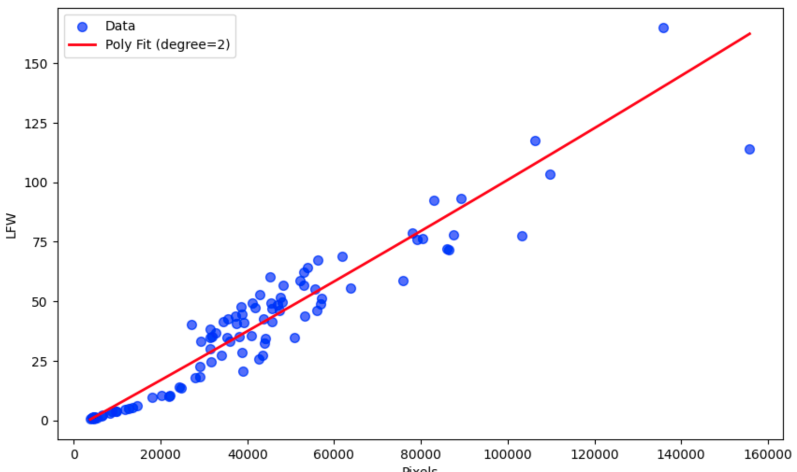
  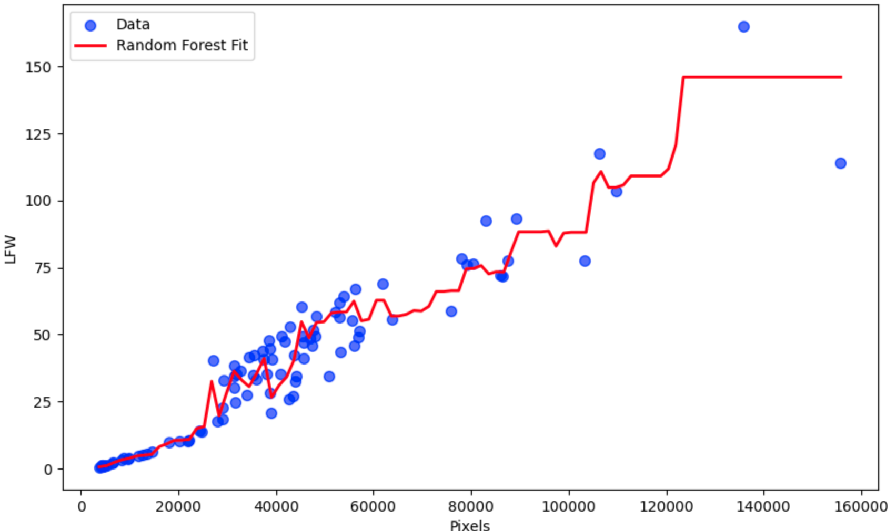
</div>

---
layout: two-cols
layoutClass: gap-x-4
---

# 模型部署演示

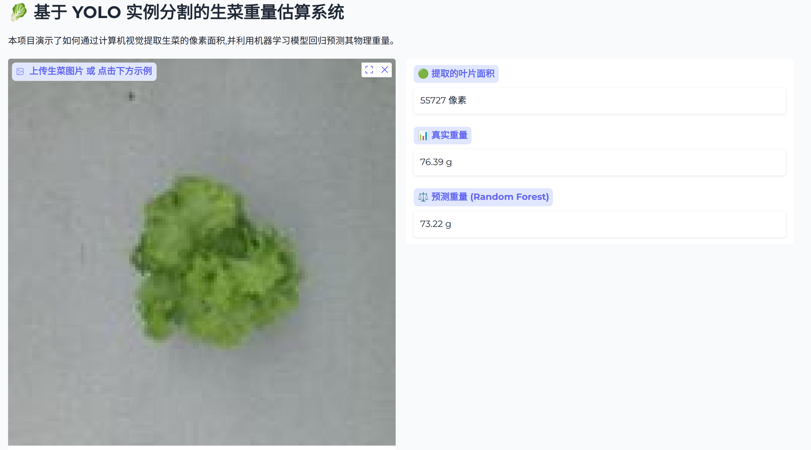

::right::

1
---

# 回归结果与统计解释

| 模型 | 输入特征 | 主要超参数 | 测试集 $R^2$ |
|---|---|---|---:|
| 线性回归 | `lettuce_pixels` | - | ~0.90 |
| 二次多项式 | `lettuce_pixels` | `degree=2` | ~0.92 |
| 随机森林 | `lettuce_pixels` | `n_estimators=100` | **0.9613** |

## 结果解读

- 单一像素面积特征已经能够解释大部分鲜重变异
- 二次多项式优于线性模型,说明像素面积与鲜重并非严格线性关系
- 随机森林进一步提升到 `R² = 0.9613`,说明局部非线性拟合更适合本任务

**在固定成像条件下,仅利用分割像素面积即可获得高精度鲜重估计,证明二维投影面积是有效的表型代理变量**

---
layout: section
---

# 结论与讨论

---

# 研究结论

## 主要结论

1. `YOLO26m-seg` 在本数据集上取得了 `mAP@50 = 0.9950`、`mAP@50:95 = 0.9297`
2. 基于分割掩码统计得到的 `lettuce_pixels` 可作为稳定且可解释的面积特征
3. 基于该单变量特征的随机森林回归实现了 `R² = 0.9613`

## 方法贡献

- 构建了"实例分割 -> 面积统计 -> 鲜重回归"的两阶段框架
- 兼顾了工程可实现性与学术可解释性
- 为温室场景下的无损表型监测提供了低成本方案

---
layout: center
---

# 谢谢
